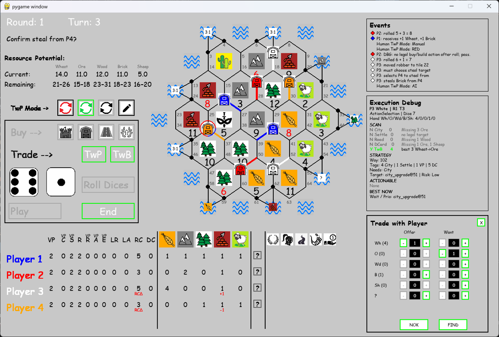

# Catan Game Project (Gen3)

Python/Pygame implementation of a **Catan-style board game**, developed as an educational AI and game-engine project.

## Features

- Beautiful hexagonal board with 45 tiles (19 land + 26 sea)
- Dynamic scoreboard and action buttons
- Pulsing highlights, animations, and confirmation system
- Modular and well-documented codebase

## Initial Placement Phase Features

- Fully interactive **human Initial Placement** with visual guidance
- Multiple advanced AI placement algorithms

## Placement Algorithms

The project includes several sophisticated Initial Placement strategies:

- **Max Pips** — highest probability intersections
- **Max Pips + Ports** — considers both resources and port access
- **5 Weighted Strategic Strategies** — balanced, Wood/Brick, Wheat/Ore, etc.
- **Markov Chain Evaluator** — advanced probability-based evaluator inspired by academic research

## Execution Phase Features

- Human Execution-phase interaction
- Trade with Bank
- Trade with Player and TwP Mode (NEW and not documented in Overview_v5.pdf)
- Buy Development Card
- Build Road / Settlement / City
- Robber movement and steal flow
- AI strategy recommendation through BEST NOW
- Expected-Hand timing and strategy continuation analysis

**[📄 Project Status, Acknowledgements, and Technical Overview (PDF)](docs/Overview_v5.pdf)**

## Prerequisites

- Python 3.8 or higher
- Pygame

## Installation

```bash
# Clone the repository
git clone https://github.com/avtnl/Catan_Gen3_v032.git
cd Catan_Gen3_v032

# Recommended: Create virtual environment
python -m venv venv
source venv/bin/activate    # On Windows: venv\Scripts\activate

# Install dependencies
pip install pygame
```

## Getting Started

```bash
python main.py
```

## License

This project is licensed under the MIT License. See the `LICENSE` file for details.
